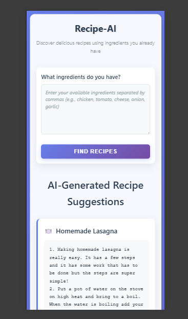

# Recipe-AI: Your Smart Kitchen Assistant

## Overview
The Recipe-AI project is an intelligent Recipe Preparation Agent designed to help users create delicious meals using only the ingredients they currently have. This application aims to minimize food waste, inspire culinary creativity, and provide personalized cooking instructions.

## Features
*   **Ingredient-Based Recipe Search**: Find recipes tailored to your available ingredients.
*   **AI-Powered Recipe Generation**: Leverages IBM Watsonx AI to generate step-by-step cooking instructions and suggest ingredient substitutions.
*   **Fallback Mechanism**: Ensures recipe generation even if AI services are unavailable, providing basic instructions from a local dataset.
*   **User-Friendly Interface**: Simple web interface for easy ingredient input and recipe display.

## Technologies Used
*   **Backend**: Flask (Python)
*   **AI/ML**: IBM Watsonx AI (`ibm/granite-13b-chat-v2` model)
*   **Data**: JSON files (`cookbook-100.json`, `recipes50.json`)
*   **Frontend**: HTML, CSS
*   **Environment**: `python-dotenv` for configuration

## Setup and Installation

### Prerequisites
*   Python 3.x
*   `pip` (Python package installer)
*   IBM Cloud account with Watsonx AI service (optional, for full AI functionality)

### Steps
1.  **Clone the repository**:
    ```bash
    git clone https://github.com/ashif57/Recipe-AI.git
    cd Recipe-AI
    ```
2.  **Create a virtual environment** (recommended):
    ```bash
    python -m venv venv
    .\venv\Scripts\activate   # On Windows
    source venv/bin/activate # On macOS/Linux
    ```
3.  **Install dependencies**:
    ```bash
    pip install -r requirements.txt
    ```
4.  **Configure Environment Variables**:
    Create a `.env` file in the root directory and add your IBM Watsonx AI credentials:
    ```
    IBM_API_KEY=your_ibm_api_key_here
    IBM_PROJECT_ID=your_ibm_project_id_here
    ```
    (If you don't have IBM Watsonx AI credentials, the application will use a fallback recipe generation method.)

## Usage
1.  **Run the Flask application**:
    ```bash
    python app.py
    ```
2.  **Access the application**:
    Open your web browser and navigate to `http://127.0.0.1:5000/` (or the address shown in your terminal).
3.  **Enter Ingredients**: Type the ingredients you have into the input field on the webpage, separated by commas, and click "Find Recipes".

## Screenshots

### Before entering ingredients


### After generating recipes


### Mobile View


### Additional Screenshots


## Project Structure
```
.
├── .gitignore
├── app.py
├── cookbook-100.json
├── ingredients.py
├── README.md
├── recipes50.json
├── requirements.txt
├── screenshots/
│   ├── after.png
│   ├── before.png
│   ├── mobile.png
│   ├── s1.png
│   └── s2.png
├── static/
│   └── style.css
└── templates/
    └── index.html
```

## Contributing
Feel free to fork the repository, create a new branch, and submit pull requests.


